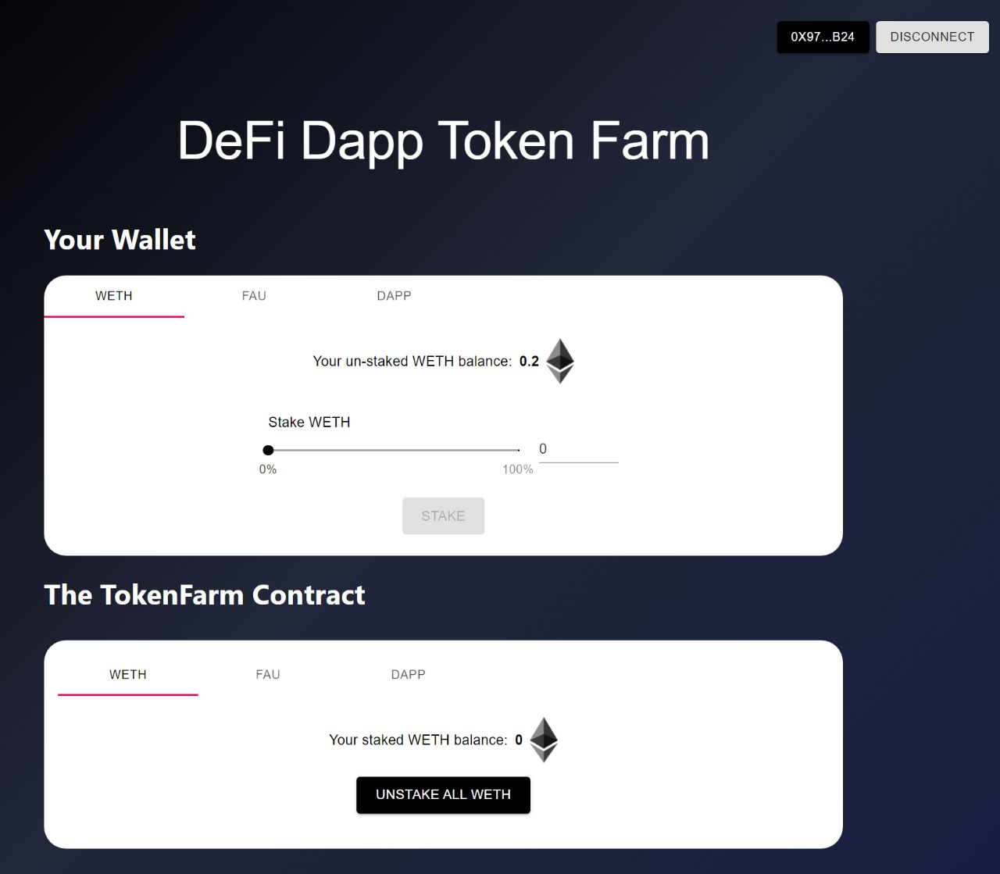

# [Yield Farming DeFi Dapp](https://yieldfarm.netlify.app/)

<br/>
<p align="center">
<a href="https://chain.link" target="_blank">

</a>
</p>
<br/>

# Check Out ⏩  [Yield Farming Dapp](https://yieldfarm.netlify.app/)

## Summary 
A Full Stack DeFi Staking Application For Yield Farming!


- `stakeTokens`: Add any approved token to the farming contract for yeild farming, collateral, or whatever you want to do.
- `unStakeTokens`: Remove your tokens from the contract.
- `getUserTotalValue`: Get the total value that users have supplied based on calculations from the Chainlink Price Feeds. 
- `issueTokens`: Issue a reward to the users staking on your platform! [OnlyOwner]

And more!

- [defi-stake-yield-brownie](#defi-stake-yield-brownie)
- [Check Out Dapp ⏩  Yield Farming App](#check-out-dapp---yield-farming-app)
  - [Summary](#summary)
    - [Check Out Contract on Kovan Etherscan ⏩  Contract on Etherscan](#check-out-contract-on-kovan-etherscan---contract-on-etherscan)
  - [Prerequisites](#prerequisites)
  - [Installation](#installation)
- [Useage](#useage)
  - [Scripts](#scripts)
  - [Front end](#front-end)
  - [Testing](#testing)
  - [Linting](#linting)
- [License](#license)

### Check Out Contract on Kovan Etherscan ⏩  [Contract on Etherscan](https://kovan.etherscan.io/address/0x77e3fffac2068bbff35050c740197f913098c230)

## Prerequisites

Please install or have installed the following:

- [nodejs and npm](https://nodejs.org/en/download/)
- [python](https://www.python.org/downloads/)
## Installation

1. [Install Brownie](https://eth-brownie.readthedocs.io/en/stable/install.html), if you haven't already. Here is a simple way to install brownie.

```bash
pip install --user pipx
pipx ensurepath
# restart your terminal
pipx install eth-brownie
```
Or if you can't get `pipx` to work, via pip (it's recommended to use pipx)
```bash
pip install eth-brownie
```

2. Clone this repo
```
git clone https://github.com/ShivaShanmuganathan/defi-dapp-yield-farm
cd defi-dapp-yield-farm
```

1. [Install ganache-cli](https://www.npmjs.com/package/ganache-cli)

```bash
npm install -g ganache-cli
```

If you want to be able to deploy to testnets, do the following. 

4. Set your environment variables

Set your `WEB3_INFURA_PROJECT_ID`, and `PRIVATE_KEY` [environment variables](https://www.twilio.com/blog/2017/01/how-to-set-environment-variables.html). 

You can get a `WEB3_INFURA_PROJECT_ID` by getting a free trial of [Infura](https://infura.io/). At the moment, it does need to be infura with brownie. You can find your `PRIVATE_KEY` from your ethereum wallet like [metamask](https://metamask.io/). 

You'll also need testnet Kovan ETH and LINK. You can get LINK and ETH into your wallet by using the [Kovan faucets located here](https://docs.chain.link/docs/link-token-contracts/#kovan). 

You'll also want an [Etherscan API Key](https://etherscan.io/apis) to verify your smart contracts. 

You can add your environment variables to the `.env` file:
```bash
export WEB3_INFURA_PROJECT_ID=<PROJECT_ID>
export PRIVATE_KEY=<PRIVATE_KEY>
export ETHERSCAN_TOKEN=<YOUR_TOKEN>
```
> DO NOT SEND YOUR KEYS TO GITHUB
> If you do that, people can steal all your funds. Ideally use an account with no real money in it. 

# Useage

## Scripts

```bash
brownie run scripts/deploy.py
```
This will deploy the contracts, depoly some mock Chainlink contracts for you to interact with.
```bash
brownie run scripts/deploy.py --network kovan
```
This will do the same thing... but on Kovan.

## Front end
```bash
cd front_end
yarn
yarn start
```
and you'll be able to interact with the UI

## Testing

```
brownie test
```

## Linting

```
pip install black 
pip install autoflake
autoflake --in-place --remove-unused-variables -r .
black .
```

# License

This project is licensed under the [MIT license](LICENSE).
